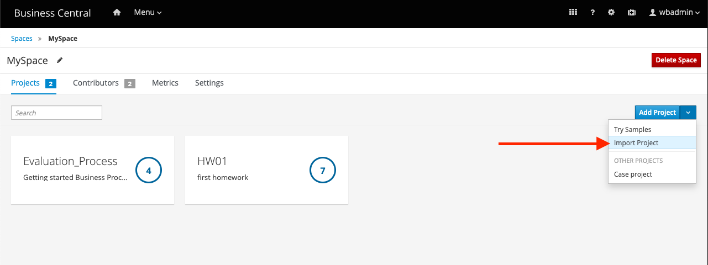

# JBPM Projekt


1. V JBPM Business central - projects/MySpace/addProject/importProject



2. Repository URL - https://github.com/gustonem/jbpm_project


3. Import


4. Lokalne naklonovat projekt
   
   ```git clone https://github.com/gustonem/jbpm_project.git```


5. ```cd jbpm_project```


6. Prepojenie medzi repozitarom a JBPM

   ```git remote add business-central ssh://wbadmin@localhost:8001/MySpace/jbpm_project```


7. Pullnute zmien z bussiness centralu (treba specifikovat spravnu branchu) - heslo: wbadmin

   ```git pull business-central master```


8. Pushnutie na github
   
   ```git push```
   
     